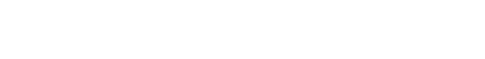
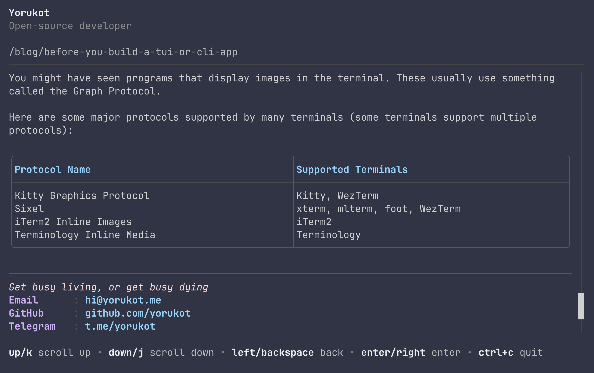

<picture>
  <source media="(prefers-color-scheme: dark)" srcset="./assets/banner-white.png">
  <source media="(prefers-color-scheme: light)" srcset="./assets/banner-black.png">
  
</picture>

---

An SSH-powered version of my personal website.

The idea is simple: instead of opening a browser, you can `ssh` into my site and read my intro, browse posts, and move around everything from the terminal. I built it because I wanted something that felt a little more personal than a normal portfolio, and because terminal-native interfaces are just more fun.

It is built with Go, [Wish](https://github.com/charmbracelet/wish), and [Bubble Tea](https://github.com/charmbracelet/bubbletea), with content synced from my main website at [yorukot.me](https://yorukot.me).

## Demo



## Contents

- [Feature](#Feature)
- [Why I built this](#why-i-built-this)
- [Try it](#try-it)
- [Run it locally](#run-it-locally)
- [Configuration](#configuration)
- [Built with](#built-with)
- [License](#license)
- [Special Thanks](#special-thanks)


## Feature

- Open the site directly over SSH.
- Read the home page and personal intro in the terminal.
- Browse blog posts from a terminal-friendly index.
- Jump straight into a post by passing a slug as the SSH command.
- Reuse the same content source as my main website.

## Why I built this

I like building things that feel fast, weird in a good way, and a bit more human than the usual template site.

While rebuilding my main website, `yorukot.me`, I realized the normal web version felt a little boring to me. I wanted a second version of it that lived in a place I genuinely enjoy using: the terminal. That idea turned into this project, a personal SSH site where the UI is a TUI, the content is still mine, and the overall experience feels much closer to how I actually work day to day.

## Try it

Connect to the live site:

```sh
ssh ssh.yorukot.me
```

Open the blog index directly:

```sh
ssh -t ssh.yorukot.me /blog
```

Jump straight to a post:

```sh
ssh -t ssh.yorukot.me before-you-build-a-tui-or-cli-app
```

## Run it locally

### Prerequisites

- Go `1.25+`
- Git
- An SSH client
- `pnpm` if you want to rebuild the blog image manifest

### Setup

Clone the repo with the website submodule:

```sh
git clone --recurse-submodules https://github.com/yorukot/ssh.yorukot.me.git
cd ssh.yorukot.me
```

If you already cloned it without submodules:

```sh
git submodule update --init --recursive
```

Generate a local SSH host key if you do not already have one:

```sh
mkdir -p .ssh
ssh-keygen -t ed25519 -f .ssh/id_ed25519 -N ""
```

Start the server:

```sh
go run cmd/main.go
```

Or with the Makefile:

```sh
make run
```

Then connect from another terminal:

```sh
ssh -p 23234 localhost
```

## Configuration

The server reads a few optional environment variables:

| Variable | Default | What it does |
| :-- | :-- | :-- |
| `HOST` | `0.0.0.0` | Host address for the SSH server |
| `PORT` | `23234` | Port for the SSH server |
| `ENV` | unset | Set to `dev` to enable dev-only behavior |
| `PPROF_ADDR` | unset | Starts a pprof HTTP server when `ENV=dev` |

Example:

```sh
HOST=127.0.0.1 PORT=23234 ENV=dev PPROF_ADDR=:6060 go run cmd/main.go
```

## Built with

- [Go](https://go.dev/)
- [Wish](https://github.com/charmbracelet/wish)
- [Bubble Tea](https://github.com/charmbracelet/bubbletea)
- [Lip Gloss](https://github.com/charmbracelet/lipgloss)
- [Goldmark](https://github.com/yuin/goldmark)

## License

This project is licensed under the MIT License. See [LICENSE](./LICENSE) for details.

If you end up building your own SSH site from this, feel free to fork it and make it your own.

## Special Thanks

<table>
  <tr>
    <td>
      Special thanks to <a href="https://ncse.tw/en/">NCSE Network</a> for providing a free VPS to host this project.
    </td>
    <td align="right">
      
    </td>
  </tr>
</table>

## Star History

<a href="https://star-history.com/#yorukot/ssh.yorukot.me&Timeline">
  <picture>
    <source media="(prefers-color-scheme: dark)" srcset="https://api.star-history.com/svg?repos=yorukot/ssh.yorukot.me&type=Timeline&theme=dark">
    <source media="(prefers-color-scheme: light)" srcset="https://api.star-history.com/svg?repos=yorukot/ssh.yorukot.me&type=Timeline">
    
  </picture>
</a>

<div align="center">

## ༼ つ ◕_◕ ༽つ  Please share.

</div>
